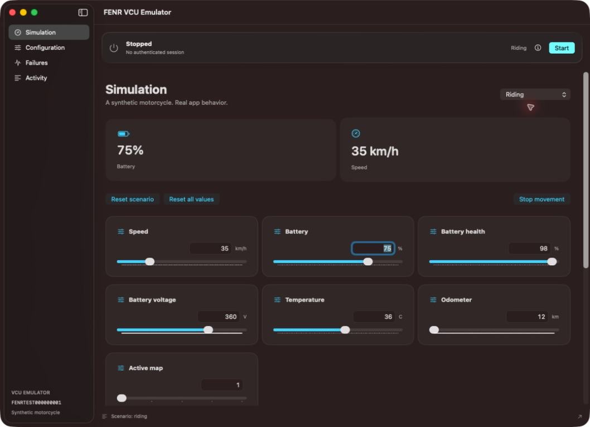

<div align="center">
  
  <h1>FENR VCU Emulator</h1>
  <p>A synthetic motorcycle on your Mac. A real Bluetooth connection to your iPhone.</p>

  [](https://github.com/fenrapp/fenr-vcu-emulator/actions/workflows/check.yml)
  [MIT license](LICENSE) · macOS 14+ · Swift 6
</div>

Test FENR without having the motorcycle nearby. This native macOS app publishes a Bluetooth LE peripheral, authenticates a V2 session and serves editable telemetry and configuration to a physical iPhone.



*Actual macOS application, shown with synthetic data and the server stopped.*

## What you can test

- **Simulation:** parked, riding, charging and partial-telemetry scenarios. Adjust battery, speed, voltage, temperatures, map and rider signals.
- **Configuration:** charging settings, five maps, signed traction values, bike lock and both 15-point advanced curves. Apply validated blocks with conflict detection and readback.
- **Failures:** authentication rejection, delayed or missing responses, frozen or malformed telemetry, incompatible firmware and accepted-but-unapplied writes.
- **Presets:** explicitly save, load, rename and delete local scenario/configuration presets.
- **Activity:** inspect the latest 1000 events, filter them and copy selected, filtered or complete logs for a reproducible bug report.

The app uses Liquid Glass on macOS 26 and native materials on earlier systems. A single session continues across all four sections.

## Getting started

### Requirements

- A Mac running macOS 14 or newer with Bluetooth LE peripheral support.
- Xcode 26.6 or newer, with its command-line tools selected. The project uses Swift 6 language mode.
- [XcodeGen](https://github.com/yonaskolb/XcodeGen) 2.42+ and Python 3.
- A physical iPhone running a compatible FENR build for end-to-end testing.

```sh
brew install xcodegen
git clone https://github.com/fenrapp/fenr-vcu-emulator.git
cd fenr-vcu-emulator
scripts/run.sh
```

The app builds with local ad hoc signing; no Apple developer team or cloud account is required. Quit an existing emulator before running the script so Launch Services cannot reuse an older executable.

### Connect FENR

1. Allow the emulator to use Bluetooth in macOS.
2. Leave **Parked** selected, press **Start** and wait for **Advertising**.
3. In FENR, connect to synthetic motorcycle `FENRTEST000000001`, using pairing date `19700101`.
4. Follow any macOS/iOS pairing prompts. The session details popover shows the synthetic motorcycle PIN; macOS controls the actual bonding flow.
5. Wait for **V2 authenticated**, then change telemetry in the Mac app and inspect the iPhone.

Start with a complete telemetry scenario. **Partial telemetry** intentionally sends battery only and can leave FENR waiting for live telemetry; use its **Return to Parked** action to recover.

## Local state and build output

The app always starts stopped in Parked with default configuration and no fault. Scenario resets preserve configuration; **Reset all values** restores it. Reconnecting preserves the active state. Presets are only loaded when you explicitly choose one, with Bluetooth stopped.

| Data | Location |
| --- | --- |
| Xcode products | `~/Library/Caches/FENRVCUEmulator/DerivedData` |
| SwiftPM products | `~/Library/Caches/FENRVCUEmulator/SwiftPM` |
| Saved presets | `~/Library/Application Support/FENRVCUEmulator/presets.json` |

`scripts/clean.sh` clears only the emulator's compiler caches. It never removes presets. Generated projects, manual in-checkout builds, logs and private captures are ignored by Git.

## Development

```sh
scripts/check.sh       # Manifest, documentation, localization, architecture and Swift/Xcode tests
scripts/generate.sh    # Regenerate the disposable Xcode project
scripts/run.sh         # Build and open the app
scripts/clean.sh       # Clear this application's compiler caches
```

GitHub Actions runs the same checks on macOS. Hardware Bluetooth tests are separate from CI. The repository builds independently, without the FENR iOS checkout or private packages.

See [CONTRIBUTING.md](CONTRIBUTING.md) for the contribution workflow and bug-report guidance.

## Documentation

- [User guide](docs/usage.md): scenarios, configuration, presets and activity.
- [Architecture](docs/architecture.md): module boundaries and lifecycle ownership.
- [Protocol compatibility](docs/compatibility.md): supported records, wire formats and client baseline.
- [Testing](docs/testing.md) and [physical checklist](docs/physical-validation.md).
- [Changelog](CHANGELOG.md) and [third-party notices](THIRD_PARTY_NOTICES.md).

## Scope

This is a behavioral emulator of the known protocol, not the motorcycle firmware or a physical vehicle model. It supports one synthetic motorcycle and one authenticated application session. Unknown configuration operations fail explicitly. macOS controls Bluetooth pairing, and stopping advertisements is not a reliable link-disconnection primitive.

Successful emulator tests do not replace final testing on the motorcycle. Full BMS diagnostics, firmware updates, ownership operations, Apple Watch support and binary distribution are outside the current scope.

## License

[MIT](LICENSE). Retained source licenses and artwork attribution are documented in [THIRD_PARTY_NOTICES.md](THIRD_PARTY_NOTICES.md).
